title
Software Architecture Model
---

# Getting started

You will use [Markdown](https://www.markdownguide.org/cheat-sheetplan) and [PlantUML](https://plantuml.com/) to describe a software architecture model about your own project.

This document will grow during the semester as you sketch and refine your software architecture model.

When you are done with each task, please push so we can give you feedback about your work.

We begin by selecting a suitable project domain.

# Ex - Domain Selection

{.instructions

Submit the name and brief description (about 100 words) of your domain using the following vision statement template:

```
For [target customers]
Who [need/opportunity/problem]
The [name your project]
Is  [type of project]
That [major features, core benefits, compelling reason to buy]
Unlike [current reality or competitors]
Our Project [summarize main advantages over status quo, unique selling point]
```

Please indicate if your choice is:

* a project you have worked on in the past (by yourself or with a team)
* a project you are going to work on this semester in another lecture (which one?)
* a new project you plan to build in the future
* some existing open source project you are interested to contribute to

The chosen domain should be unique for each student.

Please be ready to give a 2 minute presentation about it (you can use a slide but it's not necessary)

Hint: to choose a meaningful project look at the rest of the modeling tasks which you are going to perform in the context of your domain.

}

**Project Name:** *TradAgg*

**Project Type:** I plan to build this web application in near future.

**Vision Statement:** Tradagg is a web application for everyone who would like to have overview about his/her portfolio in stock market. Tradagg is an aggregator for different platforms for trading in stock market.
An user can choose from many platforms such as Robinhood, Trading212, InteractiveBrokers and also from crypto platforms like Coinbase, Binance, etc.
Hence, the user has a completely view about his portfolio in time. He can also get a notification once the value of his portfolio reaches a specific amount of money.

**Additional Information:** Gratitude and credit CS50.

# Ex - Architectural Decision Records

{.instructions

Software architecture is about making design decisions that will impact the quality of the software you plan to build.

Let's practice how to describe an architectural decision. We will keep using ADRs to document architectural decisions in the rest of the model.

Use the following template to capture one or more architectural design decisions in the context of your project domain

Pass: 1 ADR

Good: 2 ADR

Exceed: >2 ADR

}


### ADR 1

* What did you decide?
    In order to store data (persistency tier) I need a relational database.

* What was the context for your decision?
    The web application will attract many users. Hence, we need to store the huge amount of data in a secure way.
    Relational database is perfect fit for web application.
    Therefore, the goal is to store data in relational database.

* What is the scope of your decision? Does it affect the entire architecture?
    It affects the the application and database server. User interface stays untouched.

* What is the problem you are trying to solve?
    Where can I store the data?

* Which alternative options did you consider?
    List at least 3 options:

  * Relational database
  * NoSQL database (to store unstructured/semi-structured data, e. g. MongoDB)
  * RDF Triple Stores

* Which one did you choose?
    Relational Database

* What is the main reason for that?
  #### Advantages:
  * High security
  * Multi User
  * Avoid redundancy
  * Easy access to data/Easy query
  * Data integrity
  * Flexibility - CRUD

  #### Disadvantages:
  * High physical memory/storage
  * Hight initial costs

### ADR 2

* What did you decide?
    I pick MySQL in Cloud as relational database to store data.

* What was the context for your decision?
    The web application will attract many users. Hence, we need to store the huge amount of data in relational database.
    It is necessary to choose the relational database which has a good match to Python. Therefore, my goal is to store data in a efficient way with respect to the programming language.

* What is the scope of your decision? Does it affect the entire architecture?
    It affects the application and database server. User interface stays untouched.

* What is the problem you are trying to solve?
    What kind of relational database am I going to choose?

* Which alternative options did you consider?
    List at least 3 options
  * MySQL in Cloud
  * PostgreSQL in Cloud
  * MySQL no cloud

* Which one did you choose?
    MySQL in Cloud

* What is the main reason for that?
  #### Advantages:
  * Good match with Python - Easy use to connect with Python - driver "MySQL Connector"
  * Data security
  * Scalability
  * High performance

  #### Disdvantages:
  * Impedance mismatch between object-oriented and the relational world.
  * Slower performance due to joins.

### ADR 3

* What did you decide?
    I pick Django as Framework.

* What was the context for your decision?
    We have choosen MySQL in Cloud as relational database for web application and python as programming language. MySQL can be easily connected to Python with Django web framework.

* What is the scope of your decision? Does it affect the entire architecture?
    It affects the application server. User interface stays untouched.

* What is the problem you are trying to solve?
    What framework does match to Python and MySQL?

* Which alternative options did you consider?
List at least 3 options
  * Django
  * Pyramid
  * Flask - microframework

* Which one did you choose?
    Django

* What is the main reason for that?
  #### Advantages
  * Django works well with Python and MySQL
  * Better Scalability compared to the Flask

  #### Disdvantages:
  * Monolithic architecture

### ADR 4

* What did you decide?
    I pick Python as programming language.

* What was the context for your decision?
    We have choosen MySQL as relational database for web application. Consequently, we have to choose the programming language. MySQL can be easily connected to Python with Django framework.

* What is the scope of your decision? Does it affect the entire architecture?
    It affects the application server. User interface stays untouched.

* What is the problem you are trying to solve?
    What programming language fits to our needs and experience?

* Which alternative options did you consider?
    List at least 3 options:
  * Python
  * Java
  * C++

* Which one did you choose?
    Python

* What is the main reason for that?
  #### Advantages:
  * Experience with Python, Flask and MySQL - good combination
  * Flexible - intregration with other programming languages
  * Rich standard library
  * Huge Python community

  #### Disdvantages:
  * Speed limitations

# Ex - Quality Attribute Scenario

{.instructions

1. Pick a scenario for a specific quality attribute. Describe it with natural language.

2. Refine the scenario using the following structure:

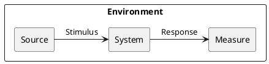

*Stimulus*: condition affecting the system

*Source*: entity generating the stimulus

*Environment*: context under which stimulus occurred (e.g., build, test, deployment, startup, normal operation, overload, failure, attack, change)

*Response*: observable result of the stimulus

*Measure*: benchmark or target value defining a successful response

Pass: 3 scenarios

Good: >3 scenarios

Exceed: >6 scenarios using challenging qualities

}


## Example Scenario

Quality: *Recoverability*

Scenario: In case of power failure, rebooting the system should take up to 20 seconds.

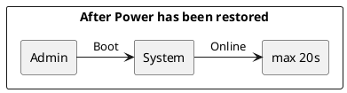

## 1 scenario

Quality: *Feasibility - Time to market*

Scenario: Our company makes a certain investment into software development so that the software is ready up to 5 months and can be used by users.


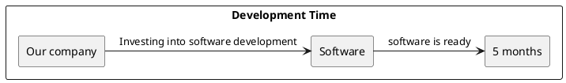

## 2 scenario

Quality: *Testability*

Scenario: Unit tester performs certain unit test on specific component of the system. Based on the unit test, unit tester will obtain result values within 3 minutes.


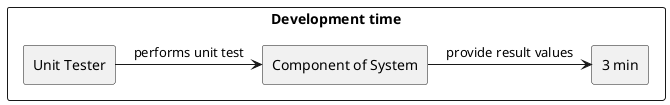

## 3 scenario

Quality: *Usability - Learnability*

Scenario: An end user wants to learn the system features of the web application. System was designed according to the various rules of human computer interaction so that the user will learn these system features within 10 minutes.

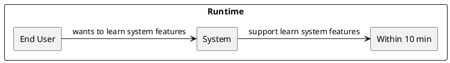

## 4 scenario

Quality: *Usability - Memorability*

Scenario: An end user logs in his/her account after 3 months. Even after 3 months the user will manage to use the web application productively within 2 minutes.

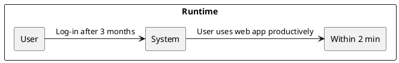

## 5 scenario

Quality: *Security - Authentication*

Scenario: An user tries to log into his account on the web application. The system authenticates the identity of the user so that the user logs in his account successufully within 2 seconds.

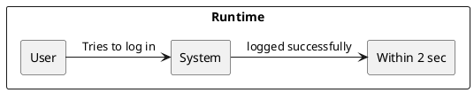

## 6 scenario

Quality: *Performance - Throughput*

Scenario: An user sends a request on the web application. The request is processed by the system with latency up to 100 ms.

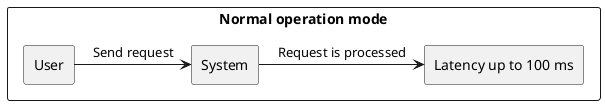

## 7 scenario

Quality: *Modifiability*

Scenario: Developer wants to change the GUI. Therefore, he needs to change the source code. As a result, the GUI is changed within 2 hours.

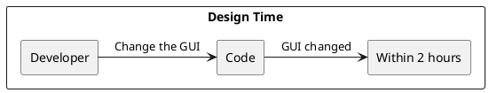


# Ex - Quality Attribute Tradeoff

{.instructions

Pick a free combination of two qualities on the [map](https://usi365.sharepoint.com/:x:/s/MSDE-2022-SoftwareArchitecture/ESVksoXVgMNHtKBKrIwatMYBqorOFaKjxnoqssEy0gNPCg?e=81W7SI) and write your name to claim it.

Then write a short text giving an example for the tradeoff in this assignment.

Pass: 1 unique trade-off

Good: 2 trade-offs

Exceed: >2 trade-offs

}

## Portability vs. Performance (Example)

Developing an app natively for each OS is expensive and time consuming, but it benefits from a good performance. Choosing a cross-platform environment on the other hand simplify the development process, making it faster and cheaper, but it might suffer in performance.

## Complexity vs. Composability
Software can be very complex due to huge amount of connections between the components. More complex the software is, the less easy is to assemble all the components. In other words, it is difficult to have high complexity and composability.

## Complexity vs. Clarity
The complex software can loose the clarity of the software. The software with high complexity, will bring less clarity. In other words, it may be very difficult to understand the complex software.

## Time to Market vs. Usability
Management wishes to launch a software product ASAP. Due to lack of time, the software is not as designed as needed. This may cause a negative effect of usability of the product. Development department is in hurry to deliver a product and so the usability factor is omitted. In other words, it may be impossible to deliver product on the market ASAP with very high usability.

## Interoperability vs. Performance
Interoperability is great quality attribute of a software. Our software product can exchange information with various different computer systems. On the other hand, the performance of our software product decreases due to this  high degree of exchange.

# Ex - Feature Modeling

{.instructions

In the context of your chosen project domain, describe your domain using a feature model.

The feature model should be correctly visualized using the following template:


If possible, make use of all modeling constructs.

Pass: Include at least 4 non-trivial features

Good: Include at least 6 non-trivial features, which are all implemented by your project

Exceed: Include more than 8 non-trivial features, indicate which are found in your project and which belong to one competitor

}


 

# Ex - Context Diagram

{.instructions

Prepare a context diagram to define the design boundary for your project.

Here is a PlantUML/C4 example to get started.


Make sure to include all possible user personas and external dependencies you may need.

Pass: 1 User and 1 Dependency

Good: >1 User and >1 Dependency

Exceed: >1 User and >1 Dependency, with both incoming and outgoing dependencies

}

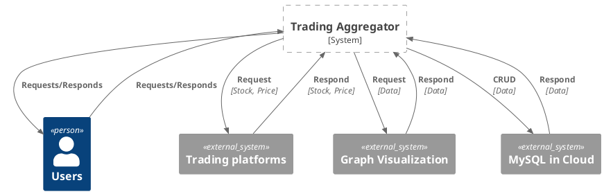

# Ex - Component Model: Top-Down

{.instructions

Within the context of your project domain, represent a model of your modular software architecture decomposed into components.

The number of components in your logical view should be between 6 and 9:

* At least one component should be further decomposed into sub components
* At least one component should already exist. You should plan how to reuse it, by locating it in some software repository and including in your model the exact link to its specification and its price.
* At least one component should be stateful.

The logical view should represent provide/require dependencies that are consistent with the interactions represented in the process view.

The process view should illustrate how the proposed decomposition is used to satisfy the main use case given by your domain model.

You can add additional process views showing how other use cases can be satisfied by the same set of components.

This assignment will focus on modularity-related decisions, we will worry about deployment and the container view later.

Here is a PlantUML example logical view and process view.

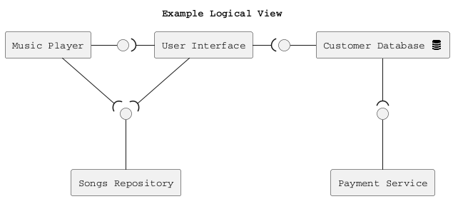

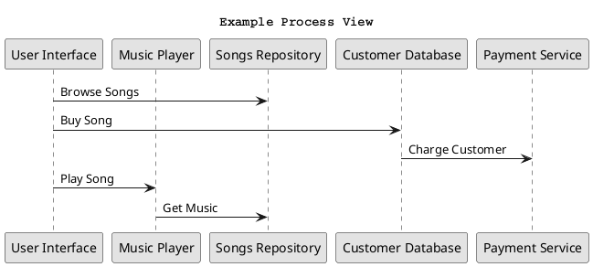

Hint: How to connect sub-components to other external components? Use this pattern.

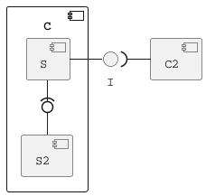

Pass: 6 components (1 decomposed), 1 use case/process view

Good: 6 components (1 decomposed), 2 use case/process view

Exceed: >6 components (>1 decomposed) and >2 use case/process view

}

## Logical View

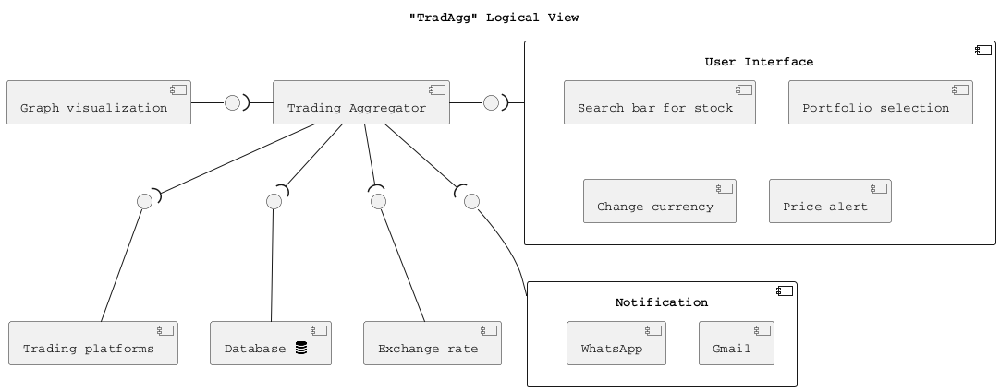

## Updated Process Views

Use Case: **Add Stock into portfolio**

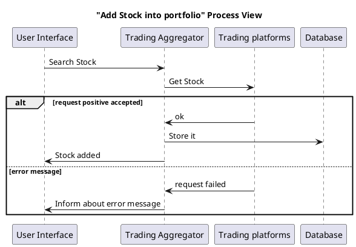


Use Case: **Visualize portfolio in pie chart**

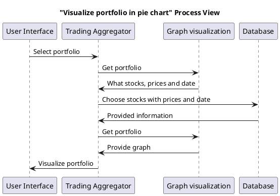


Use Case: **Update prices**

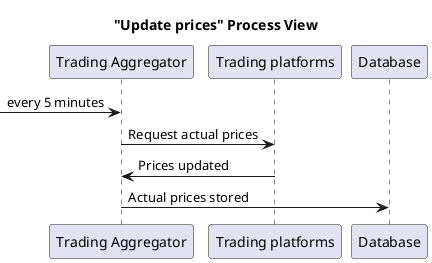


Use Case: **Visualize portfolio in EUR**

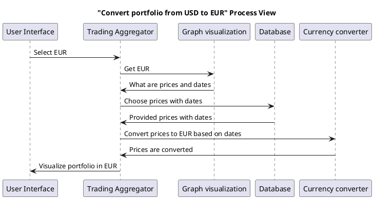

# Ex - Component Model: Bottom-Up

{.instructions

Within the context of your project domain, represent a model of your modular software architecture decomposed into components.

To design this model you should attempt to buy and reuse as many components as possible.

In addition to the logical and process views, you should give a precise list to all sources and prices of the components you have selected to be reused.

Write an ADR to document your component selection process (indicating which alternatives were considered).

Pass: Existing design with at least 1 reused components (1 Logical View, 1 Process View)

Good: Existing design with at least 3 reused components (1 Logical View, 1 Process View, 1 ADR)

Exceed: Redesign based on >3 reused components (1 Logical View, >1 Process View, >1 ADR)

}

## Reused components which are free to use:
* 1) Plotly as Python Open Source Graph Library
    * https://plotly.com/python-api-reference/
* 2) Exchangerate.host for exchange & crypto rates
    * https://exchangerate.host/#/#docs
* 3) MySQL as free open source database
    * https://dev.mysql.com/doc/connector-python/en/
* 4) Gmail API
    * https://developers.google.com/gmail/api/reference/rest
* 5) Trading platforms based on OAuth2, e. g.:
    * Coinbase https://developers.coinbase.com/api/v2
    * Binance https://developers.binance.com/docs/login/web-integration
    * Interactive Brokers https://www.interactivebrokers.com/webtradingapi


## Reused components which are charged and thas why I excluded this component:
* 1) WhatsApp API
    * https://www.whatsapp.com/business/api
    * 90 USD / month


### 1) ADR for Graph visualization

* What did you decide?
    Plotly as Python Open Source Graph Library

* What is the problem you are trying to solve?
    How can be data visualized in GUI?

* Which alternative options did you consider?
    List at least 3 options:

  * mpld3 - Python library
  * Bokeh - Python library
  * Plotly - Python library

* Which one did you choose?
    Plotly

* What is the main reason for that?
  #### Advantages:
  * No fees
  * Experience
  * Extensive range for chart types (for future plans)


### 2) ADR for Exchange rate

* What did you decide?
    Exchangerate.host for exchange & crypto rates

* What is the problem you are trying to solve?
    How can be converted the currency?

* Which alternative options did you consider?
    List at least 3 options:

  * www.exchangerate.host
  * www.exchangerate-api.com
  * www.openexchangerates.org

* Which one did you choose?
    Exchangerate.host

* What is the main reason for that?
  #### Advantages:
  * Free
  * Python friendly


### 3) ADR for Database

* What did you decide?
    MySQL as free open source database

* What is the problem you are trying to solve?
    Where can I store the data?

* Which alternative options did you consider?
    List at least 3 options
  * MySQL in Cloud
  * PostgreSQL in Cloud
  * MySQL no cloud

* Which one did you choose?
    MySQL in Cloud

  #### Advantages:
  * Free open source
  * Good match with Python - Easy use to connect with Python - driver "MySQL Connector"
  * Data security
  * Scalability
  * High performance

  #### Disdvantages:
  * Impedance mismatch between object-oriented and the relational world.
  * Slower performance due to joins.


  ## Updated Logical View

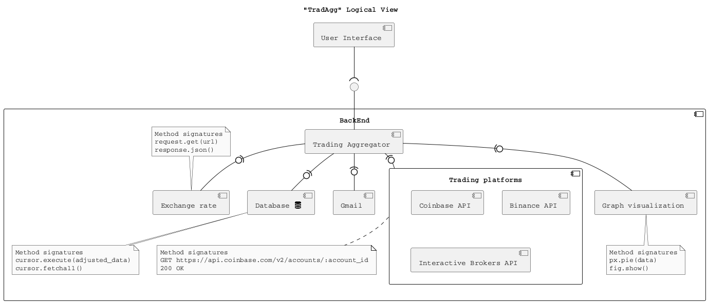

## Updated Process Views

Use Case: **Add crypto from Coinbase into portfolio**

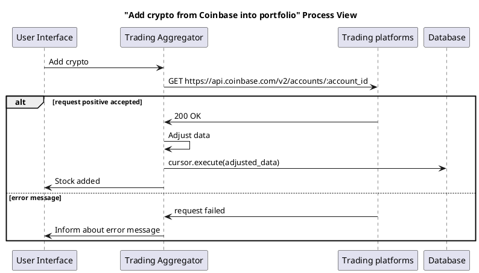


Use Case: **Visualize portfolio in pie chart**

```puml
@startuml
title "Visualize portfolio in pie chart" Process View

participant "User Interface" as UI
participant "Trading Aggregator" as TA
participant "Database" as DB
participant "Graph visualization" as GV


UI -> TA: Select portfolio
TA -> DB: cursor.execute(sql_query)
DB -> TA: cursor.fetchall()
TA -> GV: px.pie(data)
GV -> TA: fig.show()
TA -> UI: provide pie chart

@enduml
```

Use Case: **Visualize portfolio in EUR**

```puml
@startuml
title "Convert portfolio from USD to EUR" Process View

participant "User Interface" as UI
participant "Trading Aggregator" as TA
participant "Database" as DB
participant "Exchange rate" as ER
participant "Graph visualization" as GV


UI -> TA: Select EUR
TA -> DB: cursor.execute(sql_query)
DB -> TA: cursor.fetchall()
TA -> ER: request.get(url)
ER -> TA: response.json()
TA -> TA: convert prices
TA -> GV: px.pie(data)
GV -> TA: fig.show()
TA -> UI: provide pie chart

@enduml
```

Use Case: **Update prices**

```puml
@startuml
title "Update prices" Process View

participant "Trading Aggregator" as TA
participant "Trading platforms" as TP
participant "Database" as DB

-> TA: every 5 minutes
TA -> TP: Request actual prices
TP -> TA: Prices updated
TA -> DB: Actual prices stored

@enduml
```


# Ex - Interface/API Specification

{.instructions

In this iteration, we will detail your previous model to specify the provided interface of all components based on their interactions found in your existing process views.

1. choose whether to use the top down or bottom up model. If you specify the interfaces of the bottom up model, your interface descriptions should match what the components you reuse already offer.

2. decide which interface elements are operations, properties, or events.

Get started with one of these PlantUML templates, or you can come up with your own notation to describe the interfaces, as long as it includes all the necessary details.

The first template describes separately the provided/required interfaces of each component.


The second template annotates the logical view with the interface descriptions: less redundant, but needs the logical dependencies to be modeled to show which are the required interfaces.


Pass: define interfaces of all outer-level components

Good: Define interfaces of all outer-level components. Does your architecture publish a Web API? If not, extend it so that it does.

Exceed: Also, document the Web API using the OpenAPI language. You can use the [OpenAPI-to-Tree](http://api-ace.inf.usi.ch/openapi-to-tree/) tool to visualize the structure of your OpenAPI description.

}


```puml
@startuml
skinparam componentStyle true

!include <tupadr3/font-awesome/database>

title "TradAgg" Logical View
interface " " as TAI

component "User Interface" as UI
component "Web API" as API
interface " " as APII

UI --( APII
APII -- API

component "BackEnd" as BE {
    component "Trading Aggregator" as TA
    interface " " as TAI

    component "Schedule" as SCH
    interface " " as SCHI

    component "Graph visualization" as GV
    interface " " as GVI

    component "Database <$database{scale=0.33}>" as DB
    interface " " as DBI

    component "Exchange rate" as ER
    interface " " as ERI

    component "Gmail" as GM
    interface " " as GMI


    
    component "Trading platforms" as TP {
        component "Coinbase API" as CAPI
        interface " " as CAPII
        CAPII - CAPI
            note bottom of CAPII
            operation:
            ..
            GET https://www.coinbase.com/oauth/authorize?response_type=code&client_id=YOUR_CLIENT_ID&redirect_uri=https://tradagg.com&state=SECURE_RANDOM&scope=wallet:accounts:read
            GET https://example.com/oauth/callback?code=4c666b5c0c0d9d3140f2e0776cbe245f3143011d82b7a2c2a590cc7e20b79ae8&state=134ef5504a94
            POST https://api.coinbase.com/oauth/token
            GET https://api.coinbase.com/v2/accounts
            end note
        component "Binance API" as BAPI
        interface " " as BAPII
        BAPI - BAPII
            note top of BAPII
            operation:
            ..
            GET https://accounts.binance.com/en/oauth/authorize?response_type=code&client_id=YOUR_CLIENT_ID&redirect_uri=https://tradagg.com&state=CSRF_TOKEN&scope=SCOPES
            GET https://domain.com/oauth/callback?code=cf6941ae8918b6a008f1377f36a4557ab5935b36&state=377f36a4557ab5935b36
            POST https://accounts.binance.com/oauth/token?client_id=YOUR_CLIENT_ID&client_secret=YOUR_CLIENT_SECRET&grant_type=authorization_code&code=STEP3_CODE&redirect_uri=YOUR_REDIRECT_URI
            GET https://accounts.binance.com/oauth-api/user-info?access_token=xxx
            end note     
        component "Interactive Brokers API" as IBAPI
        interface " " as IBAPII
        IBAPII - IBAPI
            note bottom of IBAPII
            operation:
            ..
            POST https://www.interactivebrokers.com/tradingapi/v1/oauth/request_token
            POST https://www.interactivebrokers.com/tradingapi/v1/oauth/access_token
            GET https://www.interactivebrokers.com/tradingapi/v1/accounts/{account}/positions
            end note
    }
    interface " " as TPI
    
    TA --( GVI
    GVI -- GV

    note bottom of GVI
    operations:
    ..
    plotly.express.line(data_frame)
    plotly.express.pie(data_frame)
    show()
    end note

    TA --( SCHI
    SCHI -- SCH
    note bottom of SCHI
    operations:
    ..
    schedule.every().day.at("22:00").do(get_current_portfolio)
    schedule.every().day.at("16:00").do(get_current_portfolio)
    --
    events:
    ..
    Time Event
    end note


    TA --( DBI
    DBI -- DB
    note top of DBI
    operations:
    ..
    mysql.connector.connect(user, password, host, database_name)
    cursor()
    cursor.execute()
    commit()
    close()
    --
    events:
    ..
    AFTER UPDATE TRIGGER
    end note
    
    TA -( TPI
    TPI - TP

    TA --( ERI
    ERI -- ER
    note top of ERI
    operations:
    ..
    requests.get('https://api.exchangerate.host/latest')
    response.json()
    end note


    TA --( GMI
    GMI -- GM
    note bottom of GMI
    operation:
    ..
    Credentials.from_authorized_user_file()
    build()
    MIMEText()
    base64.urlsafe_b64encode(message.as_string())
    service.users().messages().send(userId=user_id, body=message).execute()
    POST https://gmail.googleapis.com/gmail/v1/users/{userId}/messages/send
    end note
}


API --( TAI 
TAI -- TA

note top of TAI
operations:
..
register(username, password)
login(username, password)
change_password(password)
authentication()
autorization()
add_crypto_platform(platform_name)
add_stock_platform(platform_name)
delete_crypto_platform(platform_name)
delete_stock_platform(platform_name)
get_portfolio()
provide_pie_chart()
provide_line_chart(timeframe)
select_currency_eur()
select_currency_usd()
set_price_alert(price)
set_notification_for_price_alert()
subscribe_for_news_from_markets()
store_email(email)
end note


skinparam monochrome true
skinparam shadowing false
skinparam defaultFontName Courier
@enduml
```

Web API
link: http://api-ace.inf.usi.ch/openapi-to-tree/


# Ex - Connector View

{.instructions

Extend your existing models introducing the connector view

For every pair of connected components (logical view), pick the most suitable connector. Existing components can play the role of connector, or new connectors may need to be introduced.

Make sure that the interactions shown in the process views reflect the primitives of the selected connector

Pass: model existing connectors based on previous model decisions

Good: model existing connectors based on previous model decisions, write an ADR about the choice of one connector

Exceed: introduce a new type of connector and update your existing process view
(sequence diagram) to show the connector primitives in action

}

```puml
@startuml
skinparam componentStyle true

!include <tupadr3/font-awesome/database>

title "TradAgg" Logical View
interface " " as TAI

component "User Interface" as UI
component "Web API" as API
interface " " as APII

UI --( APII
APII -- API

component "BackEnd" as BE {
    component "Trading Aggregator" as TA
    interface " " as TAI

    component "Schedule" as SCH
    interface " " as SCHI

    component "Graph visualization" as GV
    interface " " as GVI

    component "Database <$database{scale=0.33}>" as DB
    interface " " as DBI

    component "Exchange rate" as ER
    interface " " as ERI

    component "Gmail Handler" as GM
    interface " " as GMI
    
    component "Trading platforms" as TP {
        component "Coinbase API" as CAPI
        interface " " as CAPII
        CAPII - CAPI

        component "Binance API" as BAPI
        interface " " as BAPII
        BAPI - BAPII
 
        component "Interactive Brokers API" as IBAPI
        interface " " as IBAPII
        IBAPII - IBAPI
    }
    interface " " as TPI
    
    TA --( GVI
    GVI -- GV

    TA --( SCHI
    SCHI -- SCH

    TA --( DBI
    DBI -- DB
    
    TA -( TPI
    TPI - TP

    TA --( ERI
    ERI -- ER

    TA --( GMI
    GMI -- GM
}

API --( TAI 
TAI -- TA

skinparam monochrome true
skinparam shadowing false
skinparam defaultFontName Courier
@enduml
```

## Original connector view


### ADR

* What did you decide?
    * Web connector between Trading Agregator and Trading Platforms

* What is the problem you are trying to solve?
    * Trading Agregator has to pull the stocks/cryptos and prices from Trading Platforms.

* Which alternative options did you consider?
    List at least 3 options
    * Remote Procedure Call
    * Message Bus
    * Web

* Which one did you choose?
    * Web

  #### Advantages:
    * GET, but also PUT in case of Gmail
    * Immediate response compared to Message Bus - different use

  #### Disdvantages:
    * Limited amount of pull actions within 1 day for some platforms

## Updated connector view - message bus


## Process view - User subscribes for news from markets
```puml
@startuml
title "Subscribe for news from markets" Process View

participant "User Interface" as UI
participant "Trading Aggregator" as TA
participant "Bus" as BUS
participant "Trading platforms" as TP

UI -> TA: subscribe_for_news_from_markets()
TA -> BUS: subscribe
TP -> BUS: publish
BUS -> TA: notify
TA -> UI: provide news

@enduml
```


# Ex - Adapters and Coupling

{.instructions

1. Highlight the connectors (or components) in your existing bottom-up design playing the role of adapter. (We suggest to use the bottom-up design since when dealing with externally sourced components, their interfaces can be a source of mismatches).
2. Which kind of mismatch** are they solving?
3. Introduce a wrapper in your architecture to hide one of the previously highlighted adapters
4. Where would standard interfaces play a role in your architecture? Which standards could be relevant in your domain?
5. Explain how one or more pairs of components are coupled according to different coupling facets
6. Provide more details on how each adapter solves the mismatches identified using pseudo-code or the actual code
7. How can you improve your architectural model to minimize coupling between components? (Include a revised logical/connector view with your solution)

Pass: 1-5 (with one adapter)

Good: 1-6 (with at least two adapters)

Exceed: 1-7 (with at least two adapters)

** If you do not find any mismatch in your existing design we suggest to introduce one artificially.

## Hints

* (1) Should we find cases where two components cannot communicate (and are doing it wrongly) and highlight they would need an adapter?, or cases where we have already a "component playing the role of adapter in the view" and highlight only the adapter?

  *Both are fine. We assumed that if you draw a dependency (or a connector) the interfaces match, but if you detect that the components that should communicate cannot communicate then of course introduce an adapter to solve the mismatch*

* (2) Please show the details about the two interfaces which do not match (e.g., names of parameters, object structures) so that it becomes clear why an adapter is needed and what the adapter should do to bridge the mismatch

* (5-6) These questions are about the implications on coupling based on the decisions you documented in the connector view.
Whenever you have a connector you couple together the components and different connectors will have different forms of coupling

  For example, if you use calls everywhere, do you really need them everywhere? is there some pair of components where you could use a message queue instead?

  Regarding the coupling facets mentioned in question 5. You do not have to answer all questions related to "discovery", "session", "binding", "interaction", "timing", "interface" and "platform" (p.441, Coupling Facets). Just the ones that you think are relevant for your design and by answering them you can get ideas on how to do question 6.

}

## 1. Highlight the connector and components as adapter

```puml
@startuml
skinparam componentStyle true

!include <tupadr3/font-awesome/database>

title "TradAgg" Logical View
interface " " as TAI

component "User Interface" as UI
component "Web API" as API
interface " " as APII

UI --( APII
APII -- API

component "BackEnd" as BE {
    component "Trading Aggregator" as TA
    interface " " as TAI

    component "Schedule" as SCH
    interface " " as SCHI

    component "Graph visualization" as GV
    interface " " as GVI

    component "PostgreSQL Database <$database{scale=0.33}>" as DB
    interface " " as DBI

    [<<adapter>> psycopg2] as PADAPTER #Orange
    interface " " as PADAPTERI

    component "Exchange rate" as ER
    interface " " as ERI

    component "Gmail Handler" as GM
    interface " " as GMI
    
    component "Trading platforms" as TP {
        component "Coinbase API" as CAPI
        interface " " as CAPII
        CAPII - CAPI

        component "Binance API" as BAPI
        interface " " as BAPII
        BAPI - BAPII
 
        component "Interactive Brokers API" as IBAPI
        interface " " as IBAPII
        IBAPII - IBAPI
    }
    interface " " as TPI

    [<<adapter>> Web API] as AADAPTER #Orange
    interface " " as AADAPTERI

    TA -( AADAPTERI
    AADAPTERI - AADAPTER
    AADAPTER -( TPI
    TPI - TP
    
    TA --( GVI
    GVI -- GV

    TA --( SCHI
    SCHI -- SCH

    TA --( PADAPTERI
    PADAPTERI -- PADAPTER
    PADAPTER --( DBI
    DBI -- DB

    TA --( ERI
    ERI -- ER

    TA --( GMI
    GMI -- GM
}

API --( TAI 
TAI -- TA

skinparam monochrome false
skinparam shadowing false
skinparam defaultFontName Courier
@enduml
```

## 2. Which kind of mismatch are they solving?

### PostgreSQL database not compatible with Python
In order to create a mismatch in my logical view, I replaced mySQL database with PostgreSQL. PostgreSQL is a perfect match for Java. However, I code in Python. Hence, it is necessary to introduce an Adapter the psycopg2, which is a database adapter. This adapter enables to connect to the PostgreSQL database server in Python using the psycopg2.


### Bridge - Web API Adapter
Web API is a kind of bridge between the external component (Trading platforms) and the Trading Aggregator (controller). Tradding Aggregator sends a HTTP request to Web API and Web API forwards it to the Trading platforms. Then the Trading platforms send a HTTP response to the Web API and the Web API forwards it to the Tradding Aggregator.

## 3. Wrapper
```puml
@startuml
skinparam componentStyle true

!include <tupadr3/font-awesome/database>

title "TradAgg" Logical View
interface " " as TAI

component "User Interface" as UI
component "Web API" as API
interface " " as APII

UI --( APII
APII -- API

component "BackEnd" as BE {
    component "Trading Aggregator" as TA
    interface " " as TAI

    component "Schedule" as SCH
    interface " " as SCHI

    component "Graph visualization" as GV
    interface " " as GVI

    component "PostgreSQL wrapper" as PW #Orange {
        component "PostgreSQL Database <$database{scale=0.33}>" as DB
        interface " " as DBI
        [<<adapter>> psycopg2] as PADAPTER
    }
    interface " " as PADAPTERI

    component "Exchange rate" as ER
    interface " " as ERI

    component "Gmail Handler" as GM
    interface " " as GMI
    
    component "Trading Platforms wrapper" as TPW #Orange {
        component "Trading platforms" as TP {
            component "Coinbase API" as CAPI
            interface " " as CAPII
            CAPII - CAPI

            component "Binance API" as BAPI
            interface " " as BAPII
            BAPI - BAPII
    
            component "Interactive Brokers API" as IBAPI
            interface " " as IBAPII
            IBAPII - IBAPI
        }
        interface " " as TPI

        [<<adapter>> Web API] as AADAPTER
    }

    interface " " as AADAPTERI

    TA -( AADAPTERI
    AADAPTERI - AADAPTER
    AADAPTER -( TPI
    TPI - TP
    
    TA --( GVI
    GVI -- GV

    TA --( SCHI
    SCHI -- SCH

    TA --( PADAPTERI
    PADAPTERI -- PADAPTER
    PADAPTER --( DBI
    DBI -- DB

    TA --( ERI
    ERI -- ER

    TA --( GMI
    GMI -- GM
}

API --( TAI 
TAI -- TA

skinparam monochrome false
skinparam shadowing false
skinparam defaultFontName Courier
@enduml
```

## 4. Where would standard interfaces play a role in your architecture? Which standards could be relevant in your domain?

### Where and which standards?
* Exchange rate
    * Represantation format - Plain text - Json file
    * Operations - HTTP Method GET
    * Protocols - HTTP
    * Addressing - URL - "https://api.exchangerate.host/latest"

* Trading platforms - Coinbase
    * Representation format - Plain text - Json file
    * Operations - HTTP Methods GET and POST
    * Protocols - HTTP
    * Addressing - "https://api.coinbase.com/v2/accounts"

* Gmail Handler
    * Representation format - MIMEText(), base64.urlsafe_b64encode(message.as_string())
    * Operations - HTTP Method POST
    * Protocols - HTTP
    * Addressing - "https://gmail.googleapis.com/gmail/v1/users/{userId}/messages/send"

## 5. Explain how one or more pairs of components are coupled according to different coupling facets

### User Interface and Trading Aggregator

* Timing
    * User Interface and Trading Aggregator must be available at the same time because it is synchronous call.

* Interaction
    * User Interface is directly connected to the Trading Aggregator.


### Trading Aggregator and Trading platforms

* Timing
    * Both components have to be available at the same time to get portfolio of an user.

* Discovery and binding
    * User interface provides to the Trading Aggregator the Trading Platforms which should be added to his user's account.
    Thus, the Trading Aggregator finds the Trading platforms component BEFORE running time. Hence, Binding is static.

{.feedback

Very interesting. Is the trading aggregator googling for the best trading platforms and following the search engine's result links to the dynamically discovered Trading platforms? :-)

Just a question to provoke a discussion on when the discovery of what takes place.

Same comment applies to the aggregator-fx rate binding.

}

### Trading Aggregator and Exchange Rate

* Discovery and binding
    * Trading Aggregator finds the Exchange Rate component BEFORE running time thanks to the URL which is provided by business entity. By business entity is meant a person or a group of persons in our start-up that makes a decision what Exchange Rate Platform will be used. Hence, Binding is static.

### Trading Aggregator App and Trading Platforms

* Platform
    * If any trading platform changes the programming language, my app will not be affected because I access data over HTTP/JSON - loose coupling.

{.feedback

Why? If you access your data sources over HTTP/JSON, do you really care if they do not support Python?

}

## 6. Adapter solves the mismatch using code or pseudocode


{.feedback

The code is a bit verbose, please highlight or add comments to point to the essential part where the adaptation takes place.

}

#### psycopg2 database Adapter
    pip install psycopg2

    # Import psycopg2 Adapter
    import psycopg2

#### #Establish connection thanks to the Adapter
connection = psycopg2.connect(database="postgres", user='postgres', password='646hkh?kjbk', host='127.0.0.1', port= '5432')

    # Create cursor
    cursor = connection.cursor()

    # Create a database
    cursor.execute('''CREATE database tradagg''')

    # Create users table
    sql_create_table_users ='''CREATE TABLE USERS(
    USERNAME CHAR(20) PRIMARY KEY,
    PASSWORD CHAR(50),
    FIRST_NAME VARCHAR(20),
    LAST_NAME VARCHAR(20),
    PORTFOLIO_NUMBER INT REFERENCES PORTFOLIO(PORTFOLIO_NUMBER) NOT NULL,
    )'''
    cursor.execute(sql_create_table_users)

    # INSERT data into users table
    cursor.execute('''INSERT INTO USERS(USERNAME, PASSWORD, FIRST_NAME, LAST_NAME, PORTFOLIO_NUMBER) VALUES ('tmshts', 'fsfs4979fdasi98798798', 'Tomas', 'Hatas', 1)''')

    # Commit changes in database
    connection.commit()

    # Close the connection
    connection.close()


#### Web API Adapter

    # 1. step Register a new OAuth2 application under https://www.coinbase.com/sign-in

    # Data received after registering my app

    my_id_coinbase = '1532c63424622b6e9c4654e7f97ed40194a1547e114ca1c682f44283f39dfa49'

    my_client_secret_coinbase = '3a21f08c585df35c14c0c43b832640b29a3a3a18e5c54d5401f08c87c8be0b20'

    # 2. step Integrate my app with Coinbase

    ## 1. Redirect users to request Coinbase access

    import requests

    my_uri = 'https://www.tradagg.com'

    my_state_coinbase = '134ef5504a94'

    pload = {
        'response_type': code,
        'client_id': my_id_coinbase, 'redirect_uri': my_uri,
        'state': my_state_coinbase,
        'scope': wallet:user:read wallet:accounts:read
        }

#### #Access to Coinbase thanks to the web API Adapter
authorization_request = requests.get('https://www.coinbase.com/oauth/authorize/get', params=pload)

    ## 2. Coinbase redirects back to your site with temporary code

    # GET https://tradagg.com/oauth/callback?code=4c666b5c0c0d9d3140f2e0776cbe245f3143011d82b7a2c2a590cc7e20b79ae8&state=134ef5504a94

    from urllib.parse import urlparse
    from urllib.parse import parse_qs

    url = 'https://tradagg.com/oauth/callback?code=4c666b5c0c0d9d3140f2e0776cbe245f3143011d82b7a2c2a590cc7e20b79ae8&state=134ef5504a94'
    parsed_url = urlparse(url)
    temporary_code_value = parse_qs(parsed_url.query)['code'][0]

    ## 3. Exchange temporary code for an access token

    dataload = {
        'grant_type': authorization_code,
        'code': temporary_code_value,
        'client_id': my_id_coinbase,
        'client_secret': my_client_secret_coinbase,
        'redirect_uri': my_uri
    }

#### #Get access token thanks to the web API Adapter
access_token_data = requests.post('https://api.coinbase.com/oauth/token/post', data=dataload)

    # Valid Access Token as response

    '''
    {
    "access_token": "6915ab99857fec1e6f2f6c078583756d0c09d7207750baea28dfbc3d4b0f2cb80",
    "token_type": "bearer",
    "expires_in": 7200,
    "refresh_token": "73a3431906de603504c1e8437709b0f47d07bed11981fe61b522278a81a9232b7",
    "scope": "wallet:user:read wallet:accounts:read"
    }
    '''

    # extract access_token and token_type from json file

    import json as js

    json_load = js.loads(access_token_data)

    access_token_value = ''
    token_type_value = ''

    for i in json_load:
        if i == 'access_token':
            access_token_value = json_load[i]
        if i == 'token_type':
            token_type_value = json_load[i]

    # 4. API Call
    authorization_data = {
        token_type_value,
        access_token_value
    }

#### #Get user data thanks to the web API Adapter
user_data = requests.get('https://api.coinbase.com/v2/user/authorization', params=authorization_data)

    # Json file response
    '''
    {
        "data":
        {
        "id": "9da7a204-544e-5fd1-9a12-61176c5d4cd8",
        "name": "Peter Smith",
        "username": "pertersmith88",
        "profile_location": null,
        "profile_bio": null,
        "profile_url": "https://coinbase.com/pertersmith88",
        "avatar_url": "https://images.coinbase.com/avatar?h=vR%2FY8igBoPwuwGren5JMwvDNGpURAY%2F0nRIOgH%2FY2Qh%2BQ6nomR3qusA%2Bh6o2%0Af9rH&s=128",
        "resource": "user",
        "resource_path": "/v2/user"
        }
    }
    '''

    json_load = js.loads(user_data)


## 7. How can you improve your architectural model to minimize coupling between components? (Include a revised logical/connector view with your solution)

### Connector view


I am not aware of the fact that I can improve my architectural model to minimize coupling between components for the reasons:

* Remote Procedure Call (synchronous call) between User Interface and Trading Agreggator must remain as User Interface is blocked until the call is responded.

* Message bus between Trading Platforms and Trading Aggregator must remain because of subscription for news - less coupled than in case of Remote Procedure Call which is great - ASYNC AVAILABILITY

* Web API between Trading Aggregator and Gmail Handler, Exchange Rate and Trading Platforms must remain because of HTTP requests.

* Asynchronous call between Trading Aggregator and Schedule and Graph visualization since Trading Aggregator can not be blocked for the time waiting for response. Less coupled than in case of Remote Procedure Call.


# Ex - Physical and Deployment Views

{.instructions

a. Extend your architectural model with the following viewpoints:

1. Physical or Container View

2. Deployment View

Your model should be non-trivial: include more than one physical device/virtual container (or both). Be ready to discuss which connectors are found at the device/container boundaries.

b. Write an ADR about which deployment strategy you plan to adopt. The alternatives to be considered are: big bang, blue/green, shadow, pilot, gradual phase-in, canary, A/B testing.

c. (Optional) Prepare a demo of a basic continuous integration and delivery pipeline for your architectural documentation so that you can obtain a single, integrated PDF with all the viewpoints you have modeled so far.

For example:

* configure a GitHub webhook to be called whenever you push changes to your documentation
* setup a GitHub action (or similar) to build and publish your documentation on a website

Pass: 1 physical view, 1 deployment view, 1 ADR (b.)

Good: >1 physical view, >1 deployment view, 1 ADR (b.)

Exceed: 1 physical view, 1 deployment view, 1 ADR (b.) + 1 demo (c.)

}

## a.

### 1. Physical view

#### 1. version

```puml
@startuml
node "<<device>> :Application Server" as appnode {
    node "<<executionenvironment>> :PythonVM" {
    }
}

node "<<device>> :Web Server" as webnode{
}

node "<<device>> :ClientPC" as usernode{
    node "<<executionenvironment>> :Browser" {
    }
}

node "<<device>> :Database Server" as dbservernode{
}

node "<<device>> :Exchange Rate Server" as exchangenode{
}

node "<<device>> :Gmail Server" as gmailnode{
}

node "Trading platforms" as platformsnode{
    node "<<device>> :Binance Server" {
    }
    node "<<device>> :Coinbase Server" {
    }
    node "<<device>> :Interactive Brokers Server" {
    }
}

node "<<device>> :Schedule Server" as schedulenode{
}

node "<<device>> :Graph Visualization Server" as graphnode{
}

appnode -- webnode : <<internet>>

webnode -- usernode : <<internet>>

appnode --- graphnode : <<internet>>

appnode --- schedulenode : <<internet>>

appnode - platformsnode : <<HTTPS>>

appnode --- gmailnode : <<HTTPS>>

appnode -- exchangenode : <<HTTPS>>

appnode -- dbservernode : <<internet>>


skinparam monochrome false
skinparam shadowing false
skinparam defaultFontName Courier
@enduml
```

#### 2. version

```puml
@startuml
node "<<device>> :Application Server" as appnode {
    node "<<executionenvironment>> :PythonVM" {
    }
}

node "<<device>> :Web Server" as webnode{
}

node "<<device>> :ClientPC" as usernode{
    node "<<executionenvironment>> :Browser" {
    }
}

node "<<device>> :Database Server" as dbservernode{
}

node "<<device>> :Exchange Rate Server" as exchangenode{
}

node "<<device>> :Gmail Server" as gmailnode{
}

node "Trading platforms" as platformsnode{
    node "<<device>> :Binance Server" {
    }
    node "<<device>> :Coinbase Server" {
    }
    node "<<device>> :Interactive Brokers Server" {
    }
}

appnode -- webnode : <<internet>>

webnode -- usernode : <<internet>>

appnode - platformsnode : <<HTTPS>>

appnode --- gmailnode : <<HTTPS>>

appnode -- exchangenode : <<HTTPS>>

appnode -- dbservernode : <<internet>>


skinparam monochrome false
skinparam shadowing false
skinparam defaultFontName Courier
@enduml
```

### 2. Deployment view

#### 1. version

```puml
@startuml
skinparam componentStyle true

!include <tupadr3/font-awesome/database>

node "<<device>> :Application Server" as appnode {
    node "<<executionenvironment>> :PythonVM" {
        component "Trading Aggregator" as TA
    }
}

node "<<device>> :Web Server" as webnode{
    component "Web API" as API
}

node "<<device>> :ClientPC" as usernode{
    component "User Interface" as UI
    node "<<executionenvironment>> :Browser" {
    }
}

node "<<device>> :Database Server" as dbservernode{
    component "MySQL Database <$database{scale=0.33}>" as DB
}

node "<<device>> :Exchange Rate Server" as exchangenode{
    component "Exchange rate" as ER
}

node "<<device>> :Gmail Server" as gmailnode{
    component "Gmail Handler" as GM
}

node "Trading platforms" as platformsnode{
    node "<<device>> :Binance Server" {
        component "Binance API" as BAPI
    }
    node "<<device>> :Coinbase Server" {
        component "Coinbase API" as CAPI
    }
    node "<<device>> :Interactive Brokers Server" {
        component "Interactive Brokers API" as IBAPI
    }
}

node "<<device>> :Schedule Server" as schedulenode{
    component "Schedule" as SCH
}

node "<<device>> :Graph Visualization Server" as graphnode{
    component "Graph visualization" as GV
}

appnode -- webnode : <<internet>>

webnode -- usernode : <<internet>>

appnode --- graphnode : <<internet>>

appnode --- schedulenode : <<internet>>

appnode - platformsnode : <<HTTPS>>

appnode --- gmailnode : <<HTTPS>>

appnode -- exchangenode : <<HTTPS>>

appnode -- dbservernode : <<internet>>


skinparam monochrome true
skinparam shadowing false
skinparam defaultFontName Courier
@enduml
```

#### 2. version

```puml
@startuml
skinparam componentStyle true

!include <tupadr3/font-awesome/database>

node "<<device>> :Application Server" as appnode {
    node "<<executionenvironment>> :PythonVM" {
        component "Schedule" as SCH
        component "Graph visualization" as GV
        component "Trading Aggregator" as TA
    }
}

node "<<device>> :Web Server" as webnode{
    component "Web API" as API
}

node "<<device>> :ClientPC" as usernode{
    component "User Interface" as UI
    node "<<executionenvironment>> :Browser" {
    }
}

node "<<device>> :Database Server" as dbservernode{
    component "MySQL Database <$database{scale=0.33}>" as DB
}

node "<<device>> :Exchange Rate Server" as exchangenode{
    component "Exchange rate" as ER
}

node "<<device>> :Gmail Server" as gmailnode{
    component "Gmail Handler" as GM
}

node "Trading platforms" as platformsnode{
    node "<<device>> :Binance Server" {
        component "Binance API" as BAPI
    }
    node "<<device>> :Coinbase Server" {
        component "Coinbase API" as CAPI
    }
    node "<<device>> :Interactive Brokers Server" {
        component "Interactive Brokers API" as IBAPI
    }
}

appnode -- webnode : <<internet>>

webnode -- usernode : <<internet>>

appnode - platformsnode : <<HTTPS>>

appnode --- gmailnode : <<HTTPS>>

appnode -- exchangenode : <<HTTPS>>

appnode -- dbservernode : <<internet>>


skinparam monochrome true
skinparam shadowing false
skinparam defaultFontName Courier
@enduml
```

## b. ADR

* What did you decide?
    * In order to launch the product on the market I need a deployment strategy.

* What was the context for your decision?
    * The point is that we do not have any version on the market. In other words, we launch our first version of TradAgg on the market.
    Our goal is not to make bad reputation for the entire market. Therefore, we only want to touch a market with few users (friends, acquaintances, fake profiles, etc.) for a limited time. Thus, we will get a feedback from the users and consequently we can make some changes in our software.
    After making some changes, we use the Gradual Phase-In on real users. In this case, we can check the feedback from users and if everything goes according to a plan, we can bring more users, and so on.

* What is the scope of your decision? Does it affect the entire architecture?
    * If some issue appears, it may affect the entire backend or frotend depending on the scope of issue.

* What is the problem you are trying to solve?
    * The best strategy how to deploy my TradAgg application.

* Which alternative options did you consider?
    List at least 3 options:

  * Pilot
  * Gradual Phase-in
  * Canary

* Which one did you choose?
    * Pilot

* What is the main reason for that?
  #### Advantages:
  * Meticulousness - double-check
  * Avoid bad reputation
  * Quick feedback from fake users
  * Real users untouched
  * Time to work on buggs

  #### Disadvantages:
  * Longer time to launch a product for real users


## c. demo
it should work now 4th attempt:)

# Ex - Availability and Services

{.instructions

The goal of this week is to plan how to deliver your software as a service with high availability.

1. If necessary, change your deployment design so that your software is hosted on a server (which could be running as a Cloud VM). Your SaaS architecture should show how your SaaS can be remotely accessed from a client such as a Web browser, or a mobile app
2. Sketch your software as a service pricing model (optional)
3. How would you define the availability requirements in your project domain? For example, what would be your expectation for the duration of planned/unplanned downtimes or the longest response time tolerated by your clients?
4. Which strategy do you adopt to monitor your service's availability? Extend your architecture with a watchdog or a heartbeat monitor and motivate your choice with an ADR.
5. What happens when a stateless component goes down? model a sequence diagram to show what needs to happen to recover one of your critical stateless components
6. How do you plan to recover stateful components? write an ADR about your choice of replication strategy and whether you prefer consistency vs. availability. Also, consider whether event sourcing would help in your context.
7. How do you plan to avoid cascading failures? Be ready to discuss how the connectors (modeled in your connector view) impact the reliability of your architecture.
8. How did you mitigate the impact of your external dependencies being not available? (if applicable)

Pass: 1, 3, 4, one of:  5, 6, 7, 8

Good: 1, 2, 3, 4, two of:  5, 6, 7, 8

Exceed: 1, 2, 3, 4, 5, 6, 7, 8

}

# Ex - Scalability

{.instructions

Now that your architecture delivers your software as a service, let's redesign it so that it can scale!

1. Pick one scalability dimension: number of clients, size of input, size of state, number of dependencies

2. How well does your architecture scale along the chosen dimension? Where do you expect the bottleneck to be?

3. Modify your architecture to remove the scalability bottleneck you have identified (show both logical, process and deployment view) - consider whether the API/interface of the bottleneck component should be improved.

4. Write an ADR regarding the scalability pattern you have introduced.

5. Write an ADR regarding the issue of component discovery, choosing one of the alternatives: dependency injection vs. directory. Can you identify an existing component playing the role of directory/dependency injection container? Could you give an example of where you would need to add such component to facilitate dynamic component discovery?

Pass: 1, 2, 3, 5

Good: 1, 2, 3, 4, 5

Exceed: 1, 2, 3, 4, 5 then redo 1, 2, 3 for different scalability dimensions

}

# Ex - Flexibility

{.instructions

Only dead software stops changing. You just received a message from your customer, they have an idea. Is your architecture ready for it?

1. Pick a new use case scenario. Precisely, what exactly do you need to change of your existing architecture so that it can be supported? Model the updated logical/process/deployment views.

2. Pick another use case scenario so that it can be supported without any major architectural change (i.e., while you cannot add new components, it is possible to extend the interface of existing ones or introduce new dependencies). Illustrate with a process view, how your previous design can satisfy the new requirement.

3. Change impact. One of your externally sourced component/Web service API has announced it will introduce a breaking change. What is the impact of such change? How can you control and limit the impact of such change? Update your logical view

4. Open up your architecture so that it can be extended with plugins by its end-users. Where would be a good extension point? Update your logical view and give at least one example of what a plugin would actually do.

5. Assuming you have a centralized deployment with all stateful components storing their state in the same database, propose a strategy to split the monolith into at least two different microservices. Model the new logical/deployment view as well as the interfaces of each microservice you introduce.

Pass: 1, one out of 2-5.

Good: 1, two out of 2-5.

Exceed: 1-5.

}
